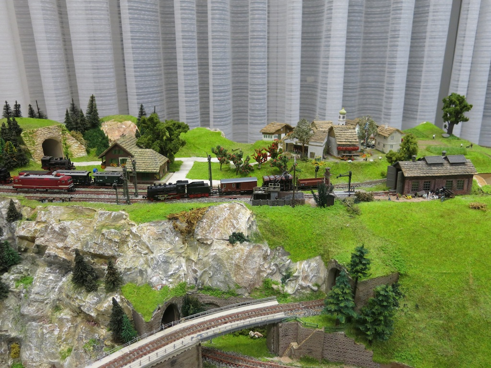
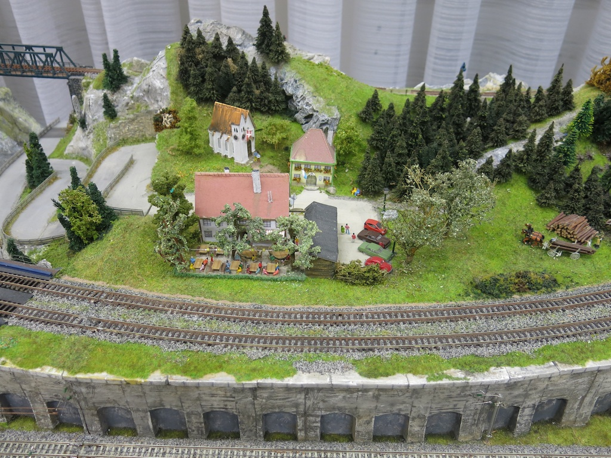
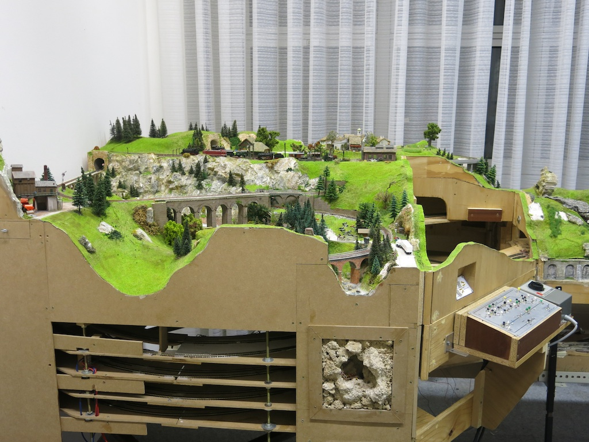
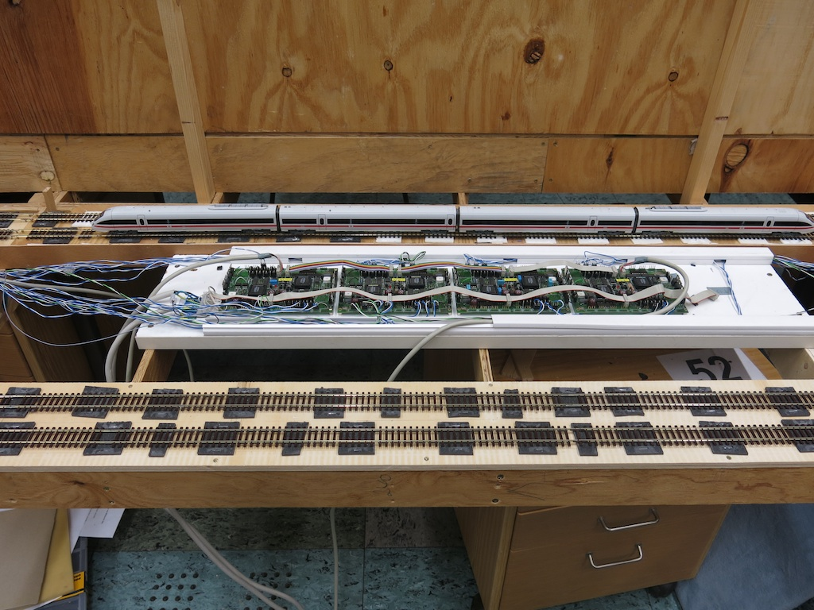

title: Eisenbahn
date: 18.02.2015
date: 2015-02-20 22:34:08
---

## N Bahn im Ma&szlig;stab 1:160
Gefahren wird auf der N-Bahn analog auf der Nebenstecke und digital
auf der Hauptstrecke.

## H0 Bahn im Ma&szlig;stab 1:87

Die H0 Modelleisenbahn ist derzeit noch im Entstehen. Gefahren wird
digital mit DCC im 2L-Leitersystem. Als Gleismaterial wird derzeit 
Roco-Line Gleis verwenden.

Die gesamte Digital-Steuerung wurde von unserem Mitglied Erhard
entwickelt. Dazu geh&ouml;rt:

* Die Schaltung und das Platienen-Layout der Block-Dekoder.
* Die Mikrocontroller-Steuerung zum erzeugen des DCC-Signals.
* Die Erstellung des gesamten Software, sowohl f&uuml;r die
  Mikrocontroller als auf f&uuml;r die PC's
  

## LGB - IIm

