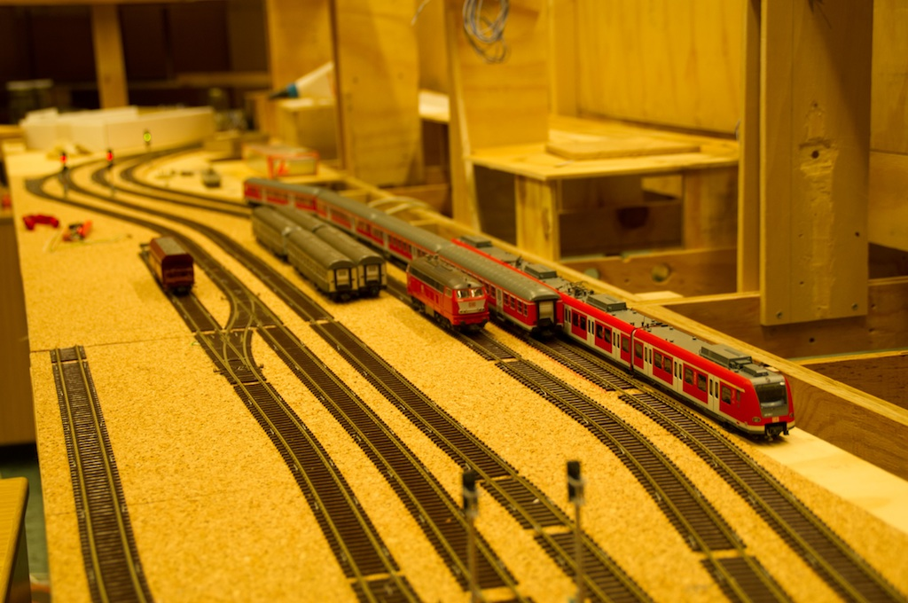
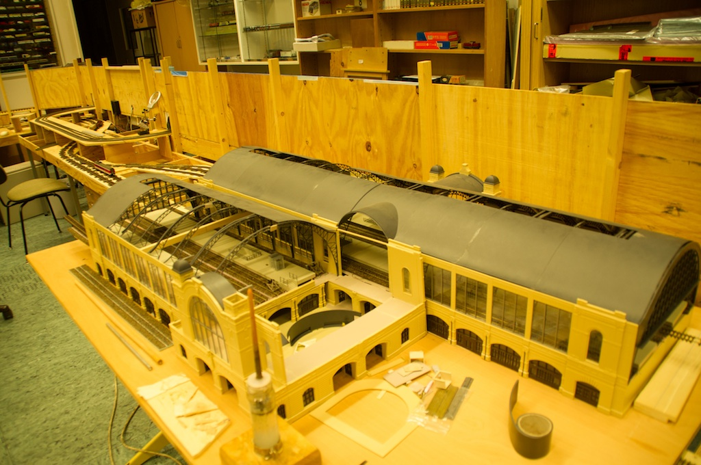
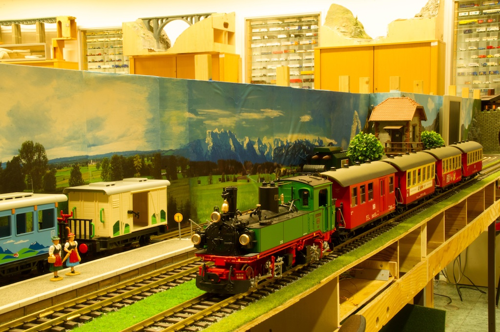

title: Eisenbahn
date: 2015-02-26 23:28:00
---
## Ansprechpartner Modelleisenbahn
Bei allen Fragen rund um die Modelleisenbahn kannst Du Dich direkt an unseren Fachgruppenleiter [J&ouml;rg Neitzel](mailto:jn.muenchen@arcor.de) wenden.

## N Bahn im Ma&szlig;stab 1:160
Die N-Bahn verfügt über eine digital gesteuerte Hauptstrecke die viel Fahrstrecke für lange Zugkombinationen bietet aber auch einen realistischen ICE Betrieb ermöglicht. Die idyllische Nebenstrecke wird gemütlich, passend zum vorherrschenden Dampflokbetrieb, analog gesteuert.

## H0 Bahn im Ma&szlig;stab 1:87

Die H0 Modelleisenbahn ist derzeit noch im Entstehen. Gefahren wird
digital mit DCC im 2L-Leitersystem. Als Gleismaterial wird derzeit 
Roco-Line Gleis verwenden.

Die gesamte Digital-Steuerung wurde von unserem Mitglied Erhard
entwickelt. Dazu geh&ouml;rt:

* Die Schaltung und das Platinen-Layout der Block-Dekoder.
* Die Mikrocontroller-Steuerung zum erzeugen des DCC-Signals.
* Die Erstellung des gesamten Software, sowohl f&uuml;r die
  Mikrocontroller als auch f&uuml;r die PC's
  

## LGB - IIm

