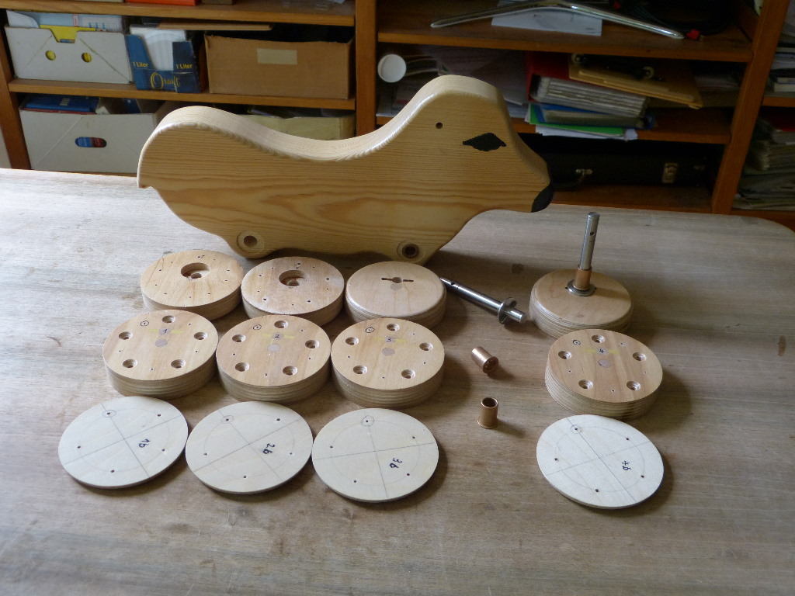
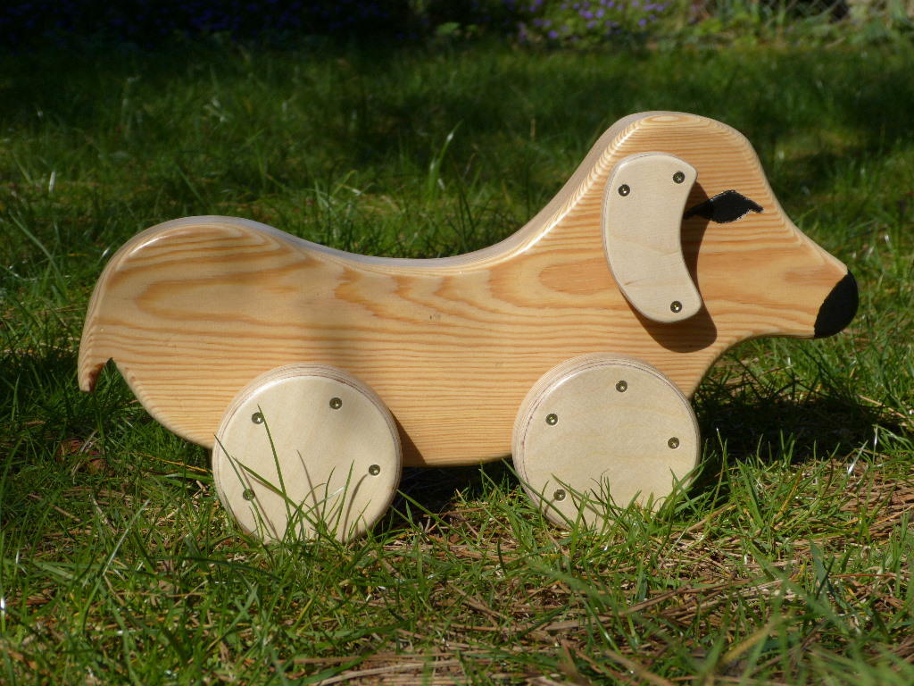
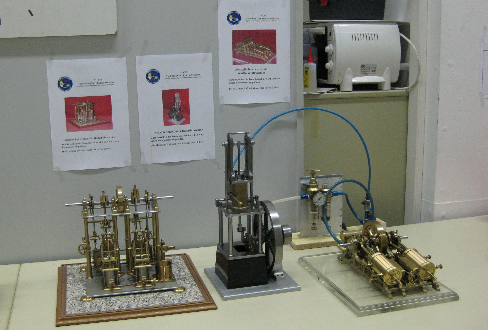
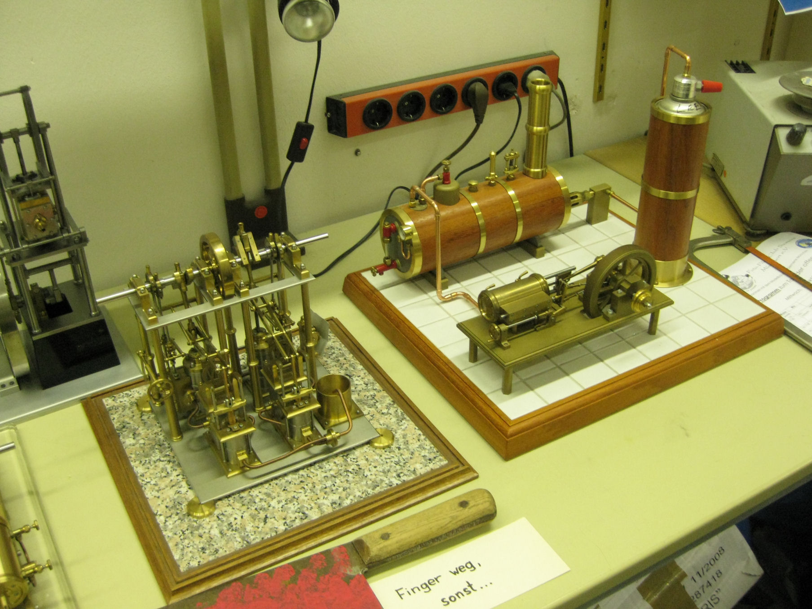

title: Modellbau
date: 2015-03-08 00:56:59
---
Bei Modellbau denken die meisten Leute erstmal an die Modelleisenbahn, als n&auml;chstes vielleicht noch an Schiffe, Flugzeuge oder ferngesteuerte Autos.

Hier wollen wir einige sch&ouml;ne Beispiele unsere Mitglieder zeigen, die nicht in die klassischen Schubladen passen.

## Kinderspielzeug

Unsere Mitglieder nutzen die Werkst&auml;tten und den Erfahrungsaustausch um ihren Kindern und Enklen eine kleine Freude zu machen.

## Dampfmaschinen

## Weihnachtskrippen

