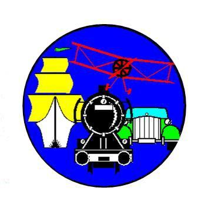

title: Über uns
date: 2015-03-04 01:46:00
---

Der MCSM bietet ein vielf&auml;ltiges Angebot, eigene Ideen zu verwirklichen:

* Holzwerkstatt
* Metallwerkstatt
* Elektronik-Arbeitsraum

# Entstehung

Der MCSM ist aus dem Modelbau Club Siemens M&uuml;nchen hervorgegangen.

* Unser Ziel ist es nicht, der beste Modelleisenbahnclub oder der beste Schiffsmodellbauclub zu sein. 
* Unser Ziel ist es Menschen die M&ouml;glichkeit zu geben eigene Projekte - egal ob Modelleisenbahn, Roboterbau, Schiffsmodelle, Dampfmaschinen, Weihnachtskrippen oder Holzspielzeug f&uuml;r die Kinder und Enkel zu verwirklichen.

# Mitgliedschaft
Wir freuen uns immer &uuml;ber neue Mitglieder.

* [Satzung](Satzung.pdf)
* [Beitrittserkl&auml;rung](Beitrittserklaerung.pdf)
* [Datenerkl&auml;rung](Datenerklaerung.pdf)
* [SEPA-Lastschrift](SEPA-Lastschrift.pdf)

# Alle Informationen als &Uuml;bersicht

* [Aushang](Aushang.pdf)
* [Flyer](Flyer.pdf)

